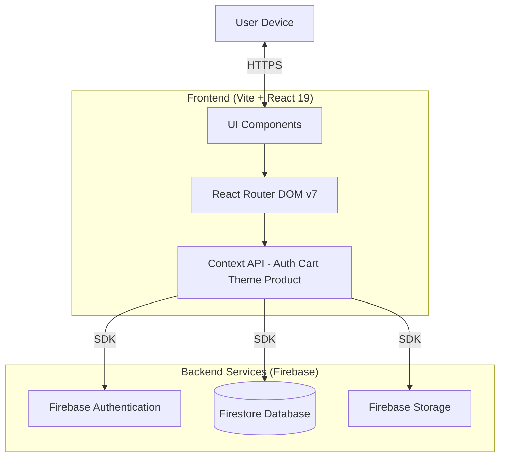

# 🚀 FindSpace - The Ultimate Campus Marketplace

<div align="center">

  **Find. List. Connect. — All within your campus.**

   [Features](#-key-features) • [Architecture](#-system-architecture) • [Getting Started](#-getting-started)

</div>

---

## 🚀 Overview

**FindSpace** is a modern, mobile-first marketplace application designed specifically for university students. It solves the chaos of WhatsApp groups and fragmented selling channels by providing a centralized, verified platform for buying and selling campus essentials—from textbooks and electronics to dorm furniture.

Built for **TechSprint'25**, FindSpace focuses on a premium user experience with glassmorphism aesthetics, smooth animations, and robust security.

## ✨ Key Features

- **🔐 Verified Campus Auth**: Secure login via Google Authentication with verified student badges for .edu email users.
- **🎨 Premium UI/UX**: A stunning design system with intentional dark mode, fluid micro-interactions, and responsive layouts.
- **📱 Mobile-First Design**: Optimized for on-the-go usage with a floating bottom navigation bar and touch-friendly interfaces.
- **🛒 Smart Cart**: Persistent shopping cart with real-time total calculation and easy management.
- **🔍 Intelligent Search**: Instant filtering by category, price, and condition to find exactly what you need.
- **📸 Seamless Selling**: Easy listing process with campus zone selection, condition badges, and image previews.
- **💬 WhatsApp Contact**: One-tap WhatsApp messaging for quick buyer-seller communication.

## 🏗 System Architecture



## 🛠 Tech Stack

- **Frontend Core**: React 19, Vite
- **Language**: JavaScript (ES6+)
- **Styling**: Vanilla CSS3 (Custom Variables, Animations, Glassmorphism)
- **State Management**: React Context API
- **Routing**: React Router v7
- **Icons**: Lucide React
- **Backend**: Firebase (Auth, Firestore)

## 🚦 Getting Started

### Prerequisites
- Node.js (v18+)
- npm or yarn

### Installation

1. **Clone the repository**
   ```bash
   git clone https://github.com/Panav-Payappagoudar/TechSprint25.git
   cd FindSpace
   ```

2. **Install Dependencies**
   ```bash
   npm install
   ```

3. **Configure Environment**
   Create a `.env` file in the root directory and add your Firebase credentials:
   ```env
   VITE_FIREBASE_API_KEY=your_api_key
   VITE_FIREBASE_AUTH_DOMAIN=your_project.firebaseapp.com
   VITE_FIREBASE_PROJECT_ID=your_project_id
   VITE_FIREBASE_STORAGE_BUCKET=your_storage_bucket
   VITE_FIREBASE_MESSAGING_SENDER_ID=your_sender_id
   VITE_FIREBASE_APP_ID=your_app_id
   ```

4. **Run Development Server**
   ```bash
   npm run dev
   ```

## 🤝 Contribution

Contributions are welcome! Please feel free to submit a Pull Request.

---

<div align="center">
  Built with passion by <b>PUJIT BALANTHIRAN</b>
</div>
